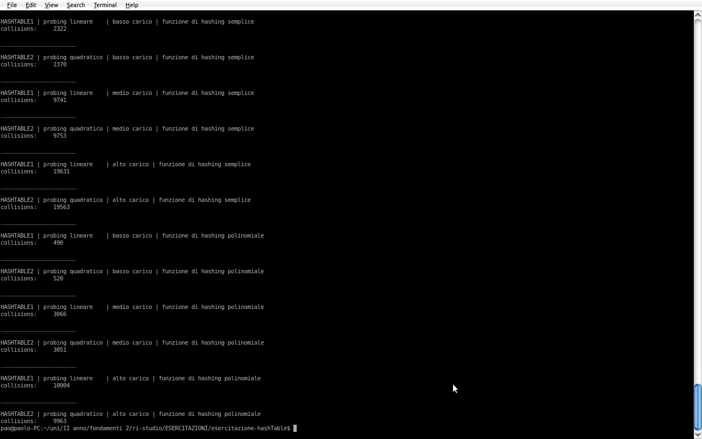
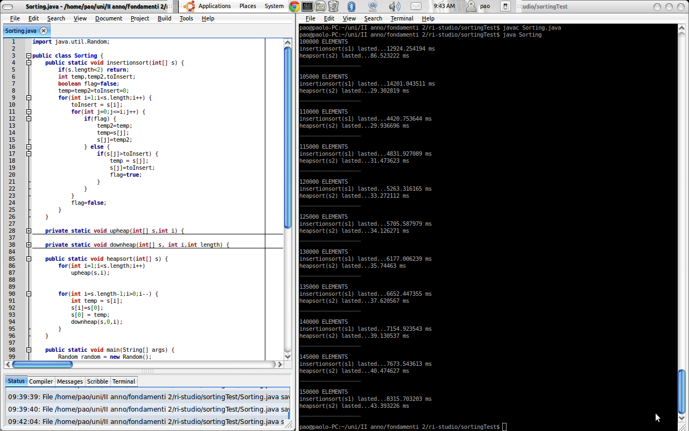
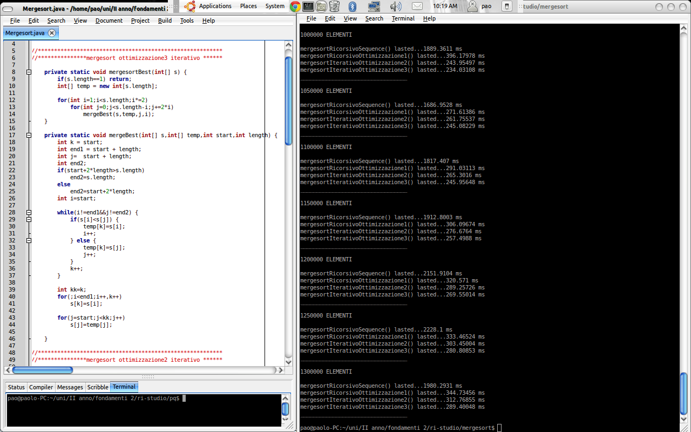
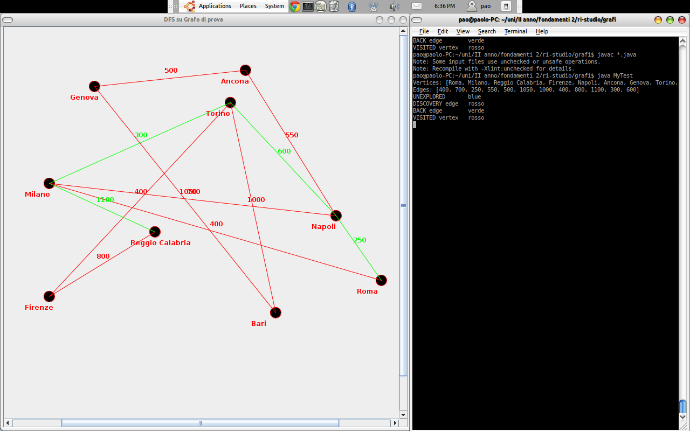
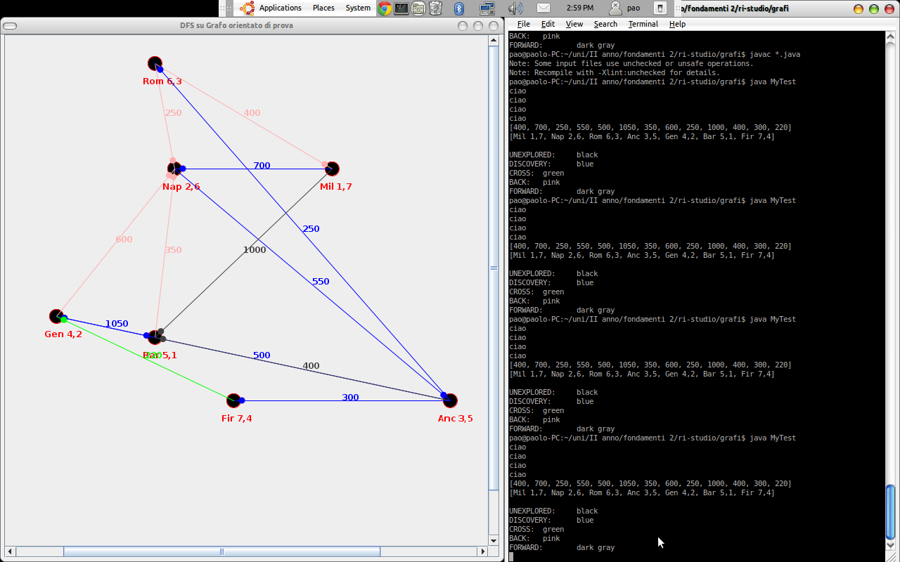
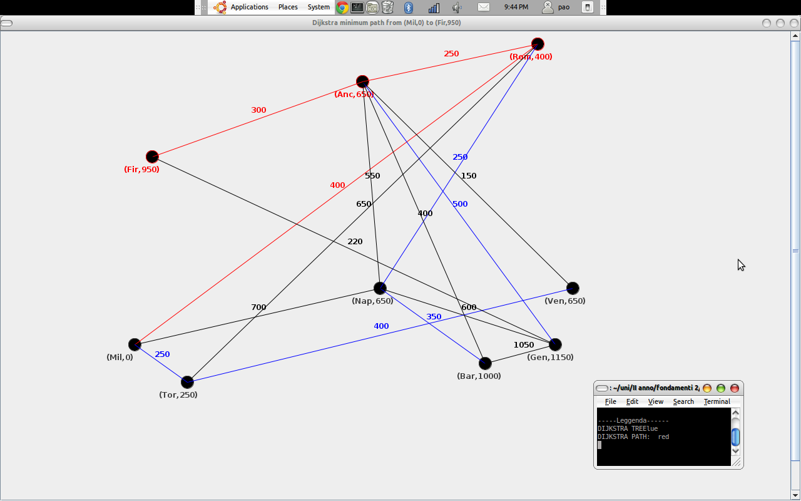
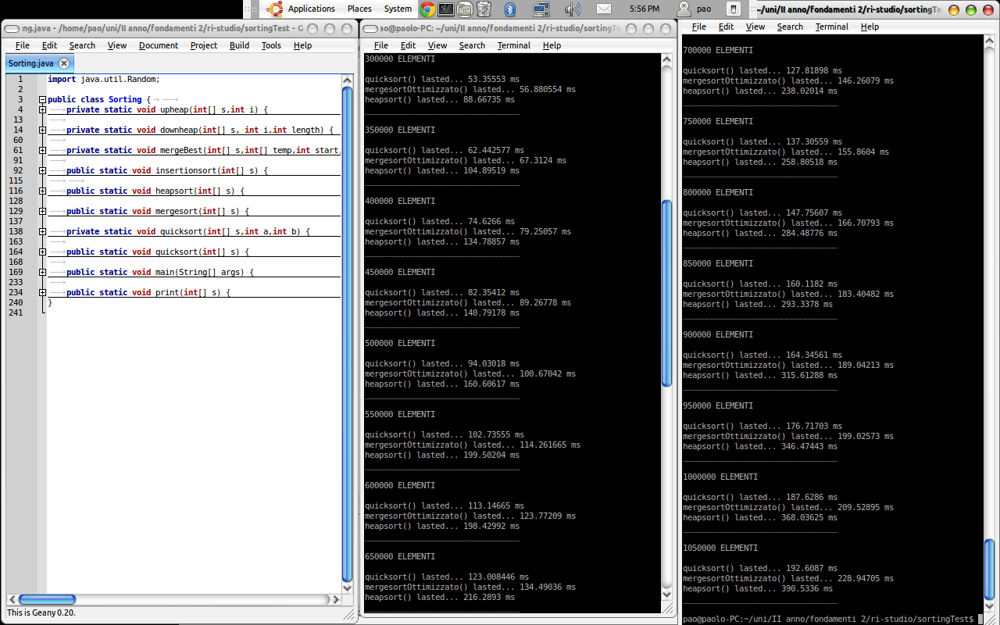
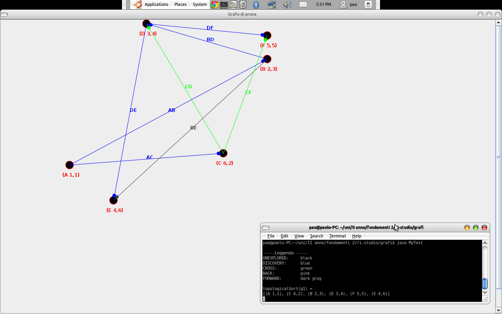

# AlgorithmsAndDataStructures

This is a lot of code I wrote 12 years ago while I was attending my university course on Algorithms and Data Structures.

You will find the following topics:
- binary trees, n-th trees
- binary search trees, AVL trees
- graphs, Dijkstra, breadth- and depth- first search
- heaps
- sorting
- lists
- priority queues
- recursion

Here you will also find some screenshots about the benchmarking of different algorithms.

